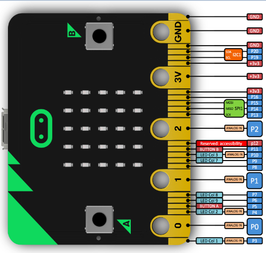
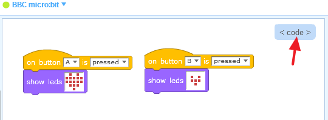
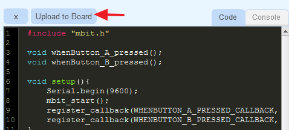
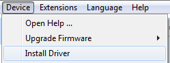

# Pinout
 

# Basic sample
## Step 1 - Connect your micro:bit
Once you have connected your micro:bit by USB cable,  selec the correct serial port and connect
 

## Step 2 - Make a basic program 
If connected Ok,  you will se a green light near **BBC micro:bit**
Now you can make the following basic program an then click ** code ** to view and upload code to your device
 

## Step 3 - Upload code to your device
Click the button **Upload to Board** and your program will be compiled and uploaded to your device.
 
__Note:__ _Only the first time you use a micro:bit, eBlock will ask you for download and install the corresponding tools to compile code._

# FAQ: Frequently Asked Questions

## Serial port desn't show
Make sure you have installed the driver ( having your micro:bit connected by USB while installing it )

## Basic code doesn't work
If the code compiles and updloads to device but it doesn't work.  Drag the file **microbit-softdevice-s110.hex**  located at **eBlock/resources/devices/bbc_microbit**